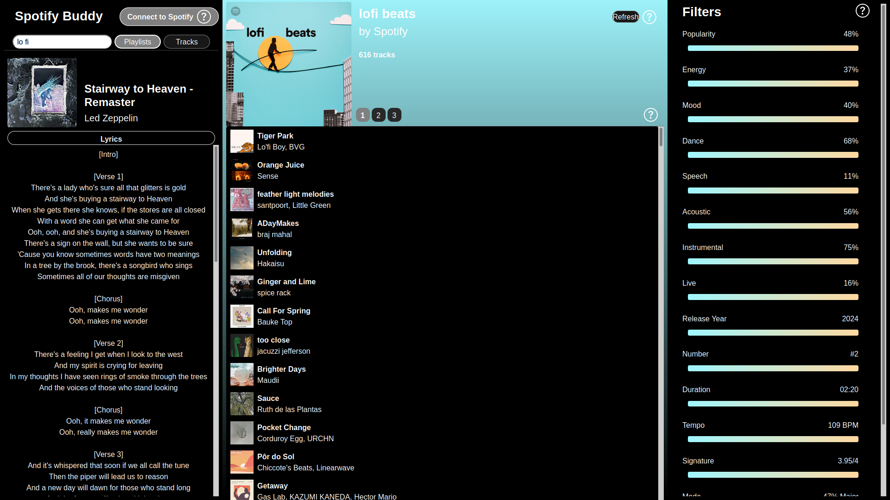

# Spotify Buddy
### [**Preview in action!**](https://dzejkob1219.pythonanywhere.com/)

A dynamic Flask app that connects to Spotify API to show metadata, filter tracks, create new playlists and more.

This is still a work in progress. Expect a lot of bugs and even more cool features coming soon. 

The app isn't optimised for mobile yet, so visit it on a desktop if you can.

## How to use
There's a **search bar** in the upper left corner, but you can only search for public playlists until you log in with Spotify.

Large playlist (thousands of tracks) take some time to load because Spotify throttles their API.

When a playlist loads, on the right you'll see information that Spotify keeps about every track, but doesn't make available in any other way than the API.

The value next to each name is the playlist average. Click any of the values to sort the tracks, click again to reverse sort and again to cancel. Hover over a bar to see the minimum and maximum values in the playlist. Drag the values to filter the tracks. 

All actions like playing the tracks or making new playlists will keep the filters and sorting. 

Click any track to view its details. When you log in you can also see your currently playing track.

Click on an image to see full-resolution album art.

If you connect to Spotify, you can **play or queue** the selected tracks (actually random shuffle included), or **save** them to a new playlist in your library.

You can also create a similar playlist with the **discover** button. The new playlist will appear in your library after a while and it will contain tracks from the same and related artists, but none of the original ones.

## Lyrics
Spotify Buddy can display lyrics for every song if they're available on genius.com.

Unfortunately, the [preview site](https://dzejkob1219.pythonanywhere.com/) is currently being hosted for free, and has limited access to the web, so it can't access the genius.com API.

Meanwhile, if you like the app and want to use it in its full functionality, you can download the source code and run it yourself.
